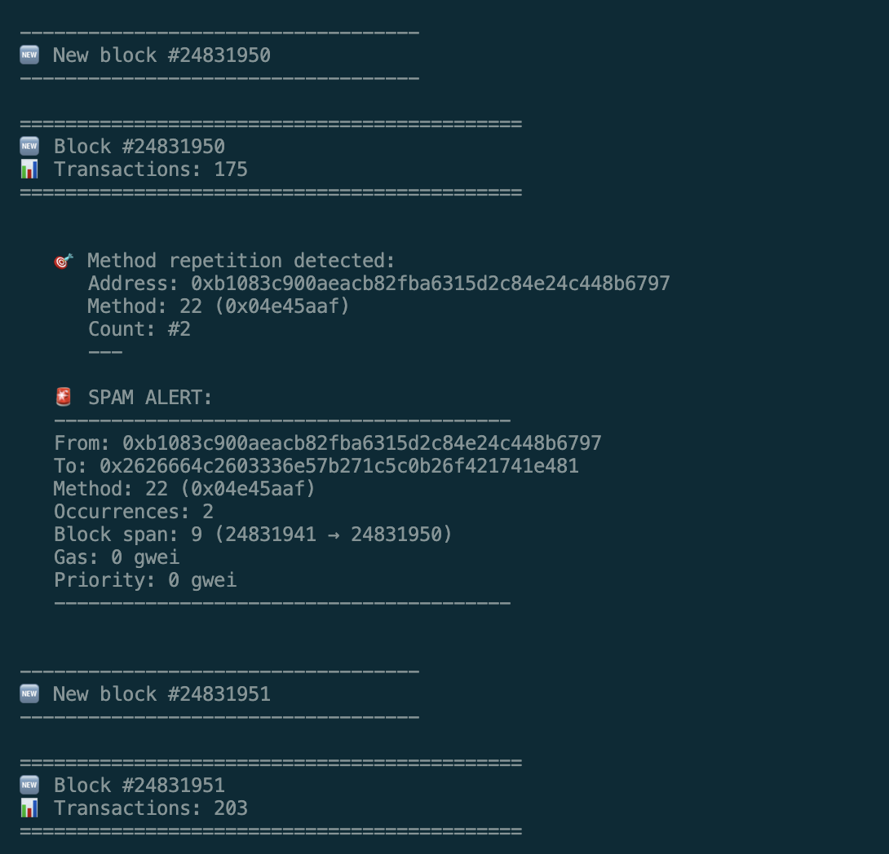

# Spammer Tracker EVM



Monitor and detect transaction spam on EVM chains. Currently configured for Base network.

## Features
- Real-time block monitoring
- Method-based spam detection
- Gas fee tracking
- Configurable block range and consecutive blocks

## Quick Start
```bash
# Install dependencies
bun install

# Run the tracker
bun run src/index.ts
```

## Configuration
You can adjust the monitoring parameters in `src/index.ts`:
```typescript
watchTransactions({
  blockRange: 20,           // Number of blocks to monitor
  minConsecutiveBlocks: 0   // Minimum consecutive blocks for spam detection
});
```

## Methods
Method signatures are defined in `methods.json`. Add or modify methods to track specific contract interactions.

---
This project was created using `bun init` in bun v1.1.34. [Bun](https://bun.sh) is a fast all-in-one JavaScript runtime.
